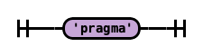{width="7.265400262467192in"
height="2.002082239720035in"}ReservedKeywords : Pragma :

Abstract :

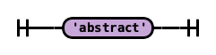{width="7.25498031496063in"
height="1.8664577865266843in"}

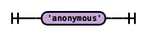{width="7.262772309711286in"
height="1.808332239720035in"}Anonymous :

Address :

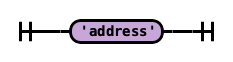{width="7.256841644794401in"
height="1.9310411198600175in"}

As :

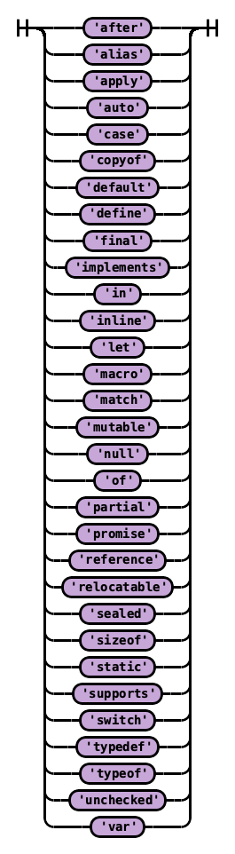{width="2.926038932633421in"
height="10.622083333333334in"}

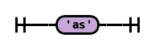{width="7.257619203849519in"
height="2.331457786526684in"}

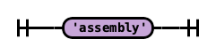{width="7.25498031496063in"
height="1.8664577865266843in"}Assembly :

Bool :

{width="7.271379046369204in"
height="2.1570833333333335in"}

{width="7.2558672353455815in"
height="2.073124453193351in"}Break :

Bytes : Calldata :

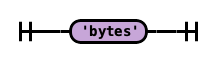{width="7.2558672353455815in"
height="2.073124453193351in"}

{width="7.25498031496063in"
height="1.8664577865266843in"}

Catch :

{width="7.2558672353455815in"
height="2.073124453193351in"}

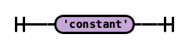{width="7.25498031496063in"
height="1.8664577865266843in"}Constant :

Constructor : Continue :

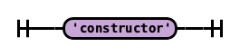{width="7.260029527559055in"
height="1.6985411198600175in"}

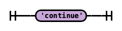{width="7.25498031496063in"
height="1.8664577865266843in"}

Contract :

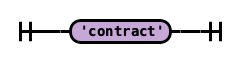{width="7.25498031496063in"
height="1.8664577865266843in"}

{width="7.265400262467192in"
height="2.002083333333333in"}Delete :

Do : Else :

{width="7.257619203849519in"
height="2.331457786526684in"}

{width="7.271379046369204in"
height="2.1570833333333335in"}

Emit :

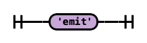{width="7.271379046369204in"
height="2.1570833333333335in"}

{width="7.271379046369204in"
height="2.1570833333333335in"}Enum :

Event : External :

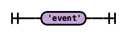{width="7.2558672353455815in"
height="2.073124453193351in"}

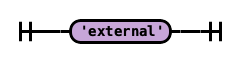{width="7.25498031496063in"
height="1.8664577865266843in"}

Fallback :

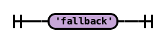{width="7.25498031496063in"
height="1.8664577865266843in"}

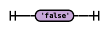{width="7.2558672353455815in"
height="2.073124453193351in"}False :

Fixed :

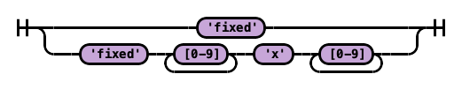{width="7.217857611548556in"
height="1.3992705599300088in"}

{width="7.271379046369204in"
height="2.157082239720035in"}From :

FixedBytes : For :

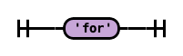{width="7.265464785651793in"
height="2.2410411198600175in"}

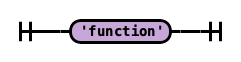{width="7.25498031496063in"
height="1.8664577865266843in"}Function :

Hex :

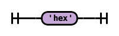{width="7.265464785651793in"
height="2.2410411198600175in"}

If :

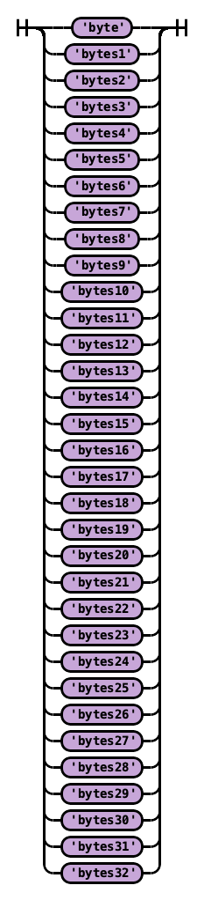{width="2.427110673665792in"
height="10.645833333333334in"}

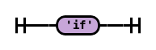{width="7.257619203849519in"
height="2.331457786526684in"}

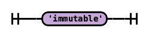{width="7.262772309711286in"
height="1.808332239720035in"}Immutable :

Import :

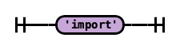{width="7.265400262467192in"
height="2.002082239720035in"}

{width="7.256841644794401in"
height="1.9310411198600175in"}Indexed :

Interface : Internal :

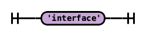{width="7.262772309711286in"
height="1.8083333333333333in"}

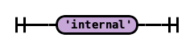{width="7.25498031496063in"
height="1.8664577865266843in"}

Is :

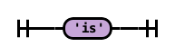{width="7.257619203849519in"
height="2.331457786526684in"}

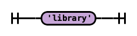{width="7.256841644794401in"
height="1.9310411198600175in"}Library :

Mapping : Memory :

{width="7.256841644794401in"
height="1.9310411198600175in"}

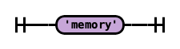{width="7.265400262467192in"
height="2.002082239720035in"}

Modifier :

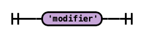{width="7.25498031496063in"
height="1.8664577865266843in"}

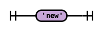{width="7.265464785651793in"
height="2.2410411198600175in"}New :

NumberUnit : Override :

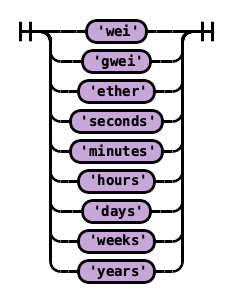{width="7.256977252843394in"
height="9.406041119860017in"}

Payable :

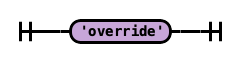{width="7.25498031496063in"
height="1.8664577865266843in"}

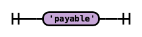{width="7.256841644794401in"
height="1.9310411198600175in"}

Private :

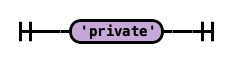{width="7.256841644794401in"
height="1.9310411198600175in"}

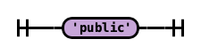{width="7.265400262467192in"
height="2.002083333333333in"}Public :

Pure : Receive :

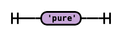{width="7.271379046369204in"
height="2.157082239720035in"}

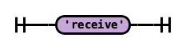{width="7.256841644794401in"
height="1.9310411198600175in"}

Return :

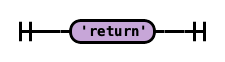{width="7.265400262467192in"
height="2.002083333333333in"}

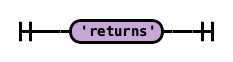{width="7.256841644794401in"
height="1.9310411198600175in"}Returns :

SignedIntegerType : Storage :

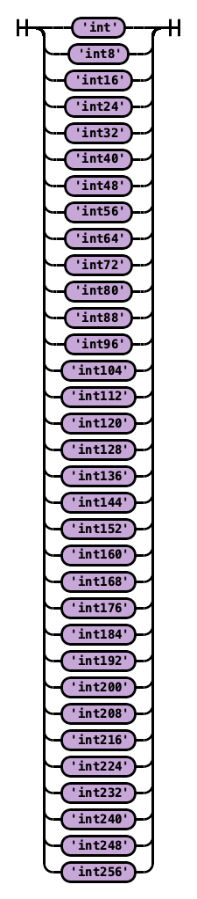{width="2.3437423447069117in"
height="10.645833333333334in"}

{width="7.256841644794401in"
height="1.9310411198600175in"}

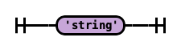{width="7.265400262467192in"
height="2.002082239720035in"}String :

Struct :

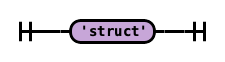{width="7.265400262467192in"
height="2.002082239720035in"}

{width="7.271379046369204in"
height="2.1570833333333335in"}True :

Try : Type :

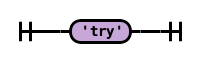{width="7.265464785651793in"
height="2.2410411198600175in"}

{width="7.271379046369204in"
height="2.1570833333333335in"}

Ufixed :

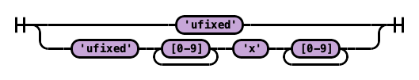{width="7.27407261592301in"
height="1.38875in"}

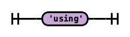{width="7.2558672353455815in"
height="2.073124453193351in"}UnsignedIntegerType : Using :

View :

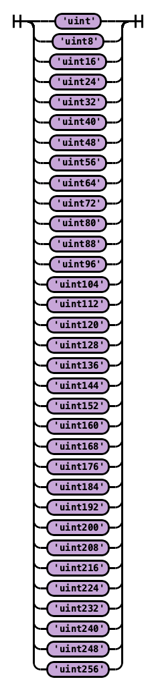{width="2.427110673665792in"
height="10.645833333333334in"}

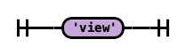{width="7.271379046369204in"
height="2.157082239720035in"}

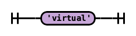{width="7.256841644794401in"
height="1.9310411198600175in"}Virtual :

While :

{width="7.2558672353455815in"
height="2.073124453193351in"}

{width="7.264924540682415in"
height="2.4347911198600176in"}LParen :

RParen : LBrack :

{width="7.264924540682415in"
height="2.4347911198600176in"}

{width="7.264924540682415in"
height="2.4347911198600176in"}

RBrack :

{width="7.264924540682415in"
height="2.4347911198600176in"}

{width="7.245653980752406in"
height="2.4283333333333332in"}LBrace :

{width="7.264924540682415in"
height="2.4347911198600176in"}RBrace :

Colon :

{width="7.264924540682415in"
height="2.4347911198600176in"}

{width="7.264924540682415in"
height="2.4347911198600176in"}Semicolon :

Period : Conditional :

{width="7.264924540682415in"
height="2.4347911198600176in"}

{width="7.264924540682415in"
height="2.4347911198600176in"}

DoubleArrow :

{width="7.257619203849519in"
height="2.331457786526684in"}

{width="7.257619203849519in"
height="2.331457786526684in"}RightArrow :

{width="7.264924540682415in"
height="2.4347911198600176in"}Assign :

AssignBitOr :

{width="7.257619203849519in"
height="2.331457786526684in"}

{width="7.257619203849519in"
height="2.331457786526684in"}AssignBitXor :

AssignBitAnd : AssignShl :

{width="7.257619203849519in"
height="2.331457786526684in"}

{width="7.265464785651793in"
height="2.2410411198600175in"}

AssignSar :

{width="7.265464785651793in"
height="2.2410411198600175in"}

{width="7.271379046369204in"
height="2.1570833333333335in"}AssignShr :

AssignAdd : AssignSub :

{width="7.257619203849519in"
height="2.331457786526684in"}

{width="7.257619203849519in"
height="2.331457786526684in"}

AssignMul :

{width="7.257619203849519in"
height="2.331457786526684in"}

{width="7.257619203849519in"
height="2.331457786526684in"}AssignDiv :

AssignMod :

{width="7.257619203849519in"
height="2.331457786526684in"}

{width="7.264924540682415in"
height="2.4347911198600176in"}Comma :

Or :

{width="7.257619203849519in"
height="2.331457786526684in"}

{width="7.257619203849519in"
height="2.331457786526684in"}And :

{width="7.264924540682415in"
height="2.4347911198600176in"}BitOr :

BitXor :

{width="7.264924540682415in"
height="2.4347911198600176in"}

{width="7.264924540682415in"
height="2.4347911198600176in"}BitAnd :

Shl : Sar :

{width="7.257619203849519in"
height="2.331457786526684in"}

{width="7.257619203849519in"
height="2.331457786526684in"}

Shr :

{width="7.265464785651793in"
height="2.2410411198600175in"}

{width="7.264924540682415in"
height="2.4347911198600176in"}Add :

Sub :

{width="7.264924540682415in"
height="2.4347911198600176in"}

{width="7.264924540682415in"
height="2.4347911198600176in"}Mul :

Div :

{width="7.264924540682415in"
height="2.4347911198600176in"}

Mod : Exp :

{width="7.264924540682415in"
height="2.4347911198600176in"}

{width="7.257619203849519in"
height="2.331457786526684in"}

Equal :

{width="7.257619203849519in"
height="2.331457786526684in"}

{width="7.257619203849519in"
height="2.331457786526684in"}NotEqual :

LessThan :

{width="7.264924540682415in"
height="2.4347911198600176in"}

{width="7.264924540682415in"
height="2.4347911198600176in"}GreaterThan :

LessThanOrEqual :

{width="7.257619203849519in"
height="2.331457786526684in"}

{width="7.257619203849519in"
height="2.331457786526684in"}GreaterThanOrEqual :

{width="7.264924540682415in"
height="2.4347911198600176in"}Not :

BitNot :

{width="7.264924540682415in"
height="2.4347911198600176in"}

{width="7.257619203849519in"
height="2.331457786526684in"}Inc :

Dec : StringLiteral :

{width="7.210027340332458in"
height="1.7197911198600175in"}

{width="7.257619203849519in"
height="2.331457786526684in"}

{width="7.273500656167979in"
height="1.5239577865266842in"}NonEmptyStringLiteral :

DoubleQuotedStringCharacter :

{width="7.265378390201225in"
height="2.0316666666666667in"}

{width="7.265378390201225in"
height="2.0316666666666667in"}SingleQuotedStringCharacter :

SingleQuotedPrintable :

{width="7.233216316710411in"
height="0.9170833333333334in"}

{width="7.284153543307086in"
height="0.9235411198600175in"}DoubleQuotedPrintable :

EscapeSequence :

{width="7.288543307086615in"
height="1.0675in"}

{width="7.254061679790026in"
height="1.4354166666666666in"}UnicodeStringLiteral :

DoubleQuotedUnicodeStringCharacter :

{width="7.251524496937883in"
height="2.44375in"}

{width="7.251524496937883in"
height="2.44375in"}SingleQuotedUnicodeStringCharacter :

HexString : HexNumber :

{width="7.281652449693788in"
height="1.4233333333333333in"}

{width="7.2578226159230095in"
height="1.2464577865266842in"}

HexDigits :

{width="7.2729155730533686in"
height="1.146978346456693in"}

{width="7.2515791776028in"
height="0.7772911198600175in"}EvenHexDigits :

HexCharacter :

{width="7.262772309711286in"
height="1.808332239720035in"}

{width="7.2470713035870515in"
height="0.9277077865266842in"}DecimalNumber :

DecimalDigits : Identifier :

{width="7.265662729658793in"
height="1.421874453193351in"}

{width="7.243003062117236in"
height="1.2403116797900262in"}

IdentifierStart :

{width="7.25498031496063in"
height="1.8664577865266843in"}

{width="7.260029527559055in"
height="1.6985411198600175in"}IdentifierPart :

WS :

{width="7.271474190726159in"
height="1.86375in"}

COMMENT : LINE\_COMMENT :

{width="7.253044619422572in"
height="1.3238538932633421in"}

{width="7.245675853018373in"
height="1.5609372265966754in"}

AssemblyDialect :

{width="7.25498031496063in"
height="1.8664577865266843in"}

{width="7.264924540682415in"
height="2.4347911198600176in"}AssemblyLBrace :

AssemblyBlockWS :

{width="7.271474190726159in"
height="1.86375in"}

AssemblyBlockCOMMENT :

{width="7.253044619422572in"
height="1.3238538932633421in"}

{width="7.245675853018373in"
height="1.5609372265966754in"}AssemblyBlockLINE\_COMMENT :

YulBreak :

{width="7.2558672353455815in"
height="2.073124453193351in"}

{width="7.271379046369204in"
height="2.1570833333333335in"}YulCase :

YulContinue :

{width="7.25498031496063in"
height="1.8664577865266843in"}

{width="7.256841644794401in"
height="1.9310411198600175in"}YulDefault :

YulFalse :

{width="7.2558672353455815in"
height="2.073124453193351in"}

{width="7.265464785651793in"
height="2.2410411198600175in"}YulFor :

YulFunction :

{width="7.25498031496063in"
height="1.8664577865266843in"}

YulIf : YulLeave :

{width="7.257619203849519in"
height="2.331457786526684in"}

{width="7.2558672353455815in"
height="2.073124453193351in"}

YulLet :

{width="7.265464785651793in"
height="2.2410411198600175in"}

{width="7.265400262467192in"
height="2.002083333333333in"}YulSwitch :

YulTrue : YulEVMBuiltin :

{width="7.271379046369204in"
height="2.157082239720035in"}

{width="7.264924540682415in"
height="2.4347911198600176in"}YulLBrace :

YulRBrace :

{width="7.264924540682415in"
height="2.4347911198600176in"}

{width="7.245653980752406in"
height="2.4283333333333332in"}YulLParen :

{width="1.3848020559930008in"
height="10.503333333333334in"}

{width="7.264924540682415in"
height="2.4347911198600176in"}YulRParen :

YulAssign :

{width="7.257619203849519in"
height="2.331457786526684in"}

{width="7.264924540682415in"
height="2.4347911198600176in"}YulPeriod :

YulComma : YulArrow :

{width="7.264924540682415in"
height="2.4347911198600176in"}

{width="7.257619203849519in"
height="2.331457786526684in"}

YulIdentifier :

{width="7.27237532808399in"
height="1.130624453193351in"}

{width="7.25498031496063in"
height="1.8664577865266843in"}YulIdentifierStart :

YulIdentifierPart : YulHexNumber :

{width="7.237288932633421in"
height="1.2942705599300088in"}

{width="7.260029527559055in"
height="1.6985411198600175in"}

{width="7.25767716535433in"
height="2.231561679790026in"}YulDecimalNumber :

YulStringLiteral :

{width="7.266800087489064in"
height="1.7333333333333334in"}

{width="7.271474190726159in"
height="1.86375in"}YulWS :

YulCOMMENT :

{width="7.253044619422572in"
height="1.3238538932633421in"}

{width="7.245675853018373in"
height="1.5609372265966754in"}YulLINE\_COMMENT :

PragmaToken :

{width="7.273741251093614in"
height="1.8711450131233596in"}

{width="7.264924540682415in"
height="2.4347911198600176in"}PragmaSemicolon :

PragmaWS :

{width="7.271474190726159in"
height="1.86375in"}

PragmaCOMMENT : PragmaLINE\_COMMENT :

> 

