|image0|\ ReservedKeywords : Pragma :

Abstract :

|image1|

|image2|\ Anonymous :

Address :

|image3|

As :

|image4|

|image5|

|image6|\ Assembly :

Bool :

|image7|

|image8|\ Break :

Bytes : Calldata :

|image9|

|image10|

Catch :

|image11|

|image12|\ Constant :

Constructor : Continue :

|image13|

|image14|

Contract :

|image15|

|image16|\ Delete :

Do : Else :

|image17|

|image18|

Emit :

|image19|

|image20|\ Enum :

Event : External :

|image21|

|image22|

Fallback :

|image23|

|image24|\ False :

Fixed :

|image25|

|image26|\ From :

FixedBytes : For :

|image27|

|image28|\ Function :

Hex :

|image29|

If :

|image30|

|image31|

|image32|\ Immutable :

Import :

|image33|

|image34|\ Indexed :

Interface : Internal :

|image35|

|image36|

Is :

|image37|

|image38|\ Library :

Mapping : Memory :

|image39|

|image40|

Modifier :

|image41|

|image42|\ New :

NumberUnit : Override :

|image43|

Payable :

|image44|

|image45|

Private :

|image46|

|image47|\ Public :

Pure : Receive :

|image48|

|image49|

Return :

|image50|

|image51|\ Returns :

SignedIntegerType : Storage :

|image52|

|image53|

|image54|\ String :

Struct :

|image55|

|image56|\ True :

Try : Type :

|image57|

|image58|

Ufixed :

|image59|

|image60|\ UnsignedIntegerType : Using :

View :

|image61|

|image62|

|image63|\ Virtual :

While :

|image64|

|image65|\ LParen :

RParen : LBrack :

|image66|

|image67|

RBrack :

|image68|

|image69|\ LBrace :

|image70|\ RBrace :

Colon :

|image71|

|image72|\ Semicolon :

Period : Conditional :

|image73|

|image74|

DoubleArrow :

|image75|

|image76|\ RightArrow :

|image77|\ Assign :

AssignBitOr :

|image78|

|image79|\ AssignBitXor :

AssignBitAnd : AssignShl :

|image80|

|image81|

AssignSar :

|image82|

|image83|\ AssignShr :

AssignAdd : AssignSub :

|image84|

|image85|

AssignMul :

|image86|

|image87|\ AssignDiv :

AssignMod :

|image88|

|image89|\ Comma :

Or :

|image90|

|image91|\ And :

|image92|\ BitOr :

BitXor :

|image93|

|image94|\ BitAnd :

Shl : Sar :

|image95|

|image96|

Shr :

|image97|

|image98|\ Add :

Sub :

|image99|

|image100|\ Mul :

Div :

|image101|

Mod : Exp :

|image102|

|image103|

Equal :

|image104|

|image105|\ NotEqual :

LessThan :

|image106|

|image107|\ GreaterThan :

LessThanOrEqual :

|image108|

|image109|\ GreaterThanOrEqual :

|image110|\ Not :

BitNot :

|image111|

|image112|\ Inc :

Dec : StringLiteral :

|image113|

|image114|

|image115|\ NonEmptyStringLiteral :

DoubleQuotedStringCharacter :

|image116|

|image117|\ SingleQuotedStringCharacter :

SingleQuotedPrintable :

|image118|

|image119|\ DoubleQuotedPrintable :

EscapeSequence :

|image120|

|image121|\ UnicodeStringLiteral :

DoubleQuotedUnicodeStringCharacter :

|image122|

|image123|\ SingleQuotedUnicodeStringCharacter :

HexString : HexNumber :

|image124|

|image125|

HexDigits :

|image126|

|image127|\ EvenHexDigits :

HexCharacter :

|image128|

|image129|\ DecimalNumber :

DecimalDigits : Identifier :

|image130|

|image131|

IdentifierStart :

|image132|

|image133|\ IdentifierPart :

WS :

|image134|

COMMENT : LINE_COMMENT :

|image135|

|image136|

AssemblyDialect :

|image137|

|image138|\ AssemblyLBrace :

AssemblyBlockWS :

|image139|

AssemblyBlockCOMMENT :

|image140|

|image141|\ AssemblyBlockLINE_COMMENT :

YulBreak :

|image142|

|image143|\ YulCase :

YulContinue :

|image144|

|image145|\ YulDefault :

YulFalse :

|image146|

|image147|\ YulFor :

YulFunction :

|image148|

YulIf : YulLeave :

|image149|

|image150|

YulLet :

|image151|

|image152|\ YulSwitch :

YulTrue : YulEVMBuiltin :

|image153|

|image154|\ YulLBrace :

YulRBrace :

|image155|

|image156|\ YulLParen :

|image157|

|image158|\ YulRParen :

YulAssign :

|image159|

|image160|\ YulPeriod :

YulComma : YulArrow :

|image161|

|image162|

YulIdentifier :

|image163|

|image164|\ YulIdentifierStart :

YulIdentifierPart : YulHexNumber :

|image165|

|image166|

|image167|\ YulDecimalNumber :

YulStringLiteral :

|image168|

|image169|\ YulWS :

YulCOMMENT :

|image170|

|image171|\ YulLINE_COMMENT :

PragmaToken :

|image172|

|image173|\ PragmaSemicolon :

PragmaWS :

|image174|

PragmaCOMMENT : PragmaLINE_COMMENT :

   |image175|

|image176|

.. |image0| image:: lexar-output/image1.png
   :width: 7.2654in
   :height: 2.00208in
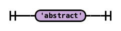
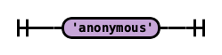
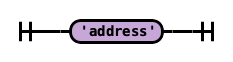
.. |image4| image:: lexar-output/image5.png
   :width: 2.92604in
   :height: 10.62208in
.. |image5| image:: lexar-output/image6.png
   :width: 7.25762in
   :height: 2.33146in
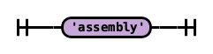
.. |image7| image:: lexar-output/image8.png
   :width: 7.27138in
   :height: 2.15708in
.. |image8| image:: lexar-output/image9.png
   :width: 7.25587in
   :height: 2.07312in
.. |image9| image:: lexar-output/image10.png
   :width: 7.25587in
   :height: 2.07312in
.. |image10| image:: lexar-output/image11.png
   :width: 7.25498in
   :height: 1.86646in
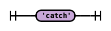
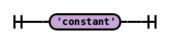
.. |image13| image:: lexar-output/image14.png
   :width: 7.26003in
   :height: 1.69854in
.. |image14| image:: lexar-output/image15.png
   :width: 7.25498in
   :height: 1.86646in
.. |image15| image:: lexar-output/image16.png
   :width: 7.25498in
   :height: 1.86646in
.. |image16| image:: lexar-output/image17.png
   :width: 7.2654in
   :height: 2.00208in
.. |image17| image:: lexar-output/image18.png
   :width: 7.25762in
   :height: 2.33146in

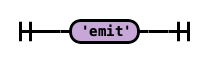

.. |image21| image:: lexar-output/image22.png
   :width: 7.25587in
   :height: 2.07312in
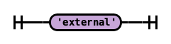
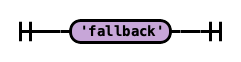
.. |image24| image:: lexar-output/image25.png
   :width: 7.25587in
   :height: 2.07312in
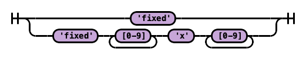
.. |image26| image:: lexar-output/image27.png
   :width: 7.27138in
   :height: 2.15708in
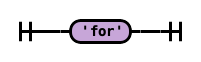
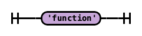
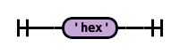
.. |image30| image:: lexar-output/image31.png
   :width: 2.42711in
   :height: 10.64583in
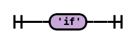
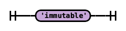
.. |image33| image:: lexar-output/image34.png
   :width: 7.2654in
   :height: 2.00208in
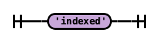
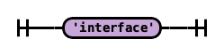
.. |image36| image:: lexar-output/image37.png
   :width: 7.25498in
   :height: 1.86646in
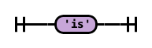
.. |image38| image:: lexar-output/image39.png
   :width: 7.25684in
   :height: 1.93104in
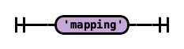
.. |image40| image:: lexar-output/image41.png
   :width: 7.2654in
   :height: 2.00208in
.. |image41| image:: lexar-output/image42.png
   :width: 7.25498in
   :height: 1.86646in
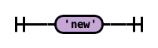
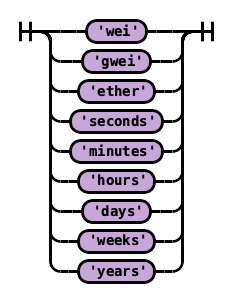
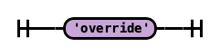
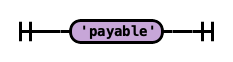
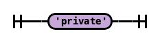
.. |image47| image:: lexar-output/image48.png
   :width: 7.2654in
   :height: 2.00208in
.. |image48| image:: lexar-output/image49.png
   :width: 7.27138in
   :height: 2.15708in
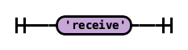
.. |image50| image:: lexar-output/image51.png
   :width: 7.2654in
   :height: 2.00208in
.. |image51| image:: lexar-output/image52.png
   :width: 7.25684in
   :height: 1.93104in
.. |image52| image:: lexar-output/image53.png
   :width: 2.34374in
   :height: 10.64583in
.. |image53| image:: lexar-output/image54.png
   :width: 7.25684in
   :height: 1.93104in
.. |image54| image:: lexar-output/image55.png
   :width: 7.2654in
   :height: 2.00208in
.. |image55| image:: lexar-output/image56.png
   :width: 7.2654in
   :height: 2.00208in
.. |image56| image:: lexar-output/image57.png
   :width: 7.27138in
   :height: 2.15708in
.. |image57| image:: lexar-output/image58.png
   :width: 7.26546in
   :height: 2.24104in
.. |image58| image:: lexar-output/image59.png
   :width: 7.27138in
   :height: 2.15708in
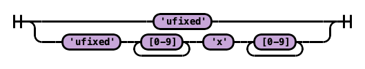
.. |image60| image:: lexar-output/image61.png
   :width: 7.25587in
   :height: 2.07312in
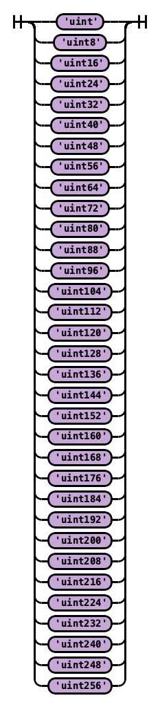
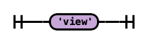
.. |image63| image:: lexar-output/image64.png
   :width: 7.25684in
   :height: 1.93104in
.. |image64| image:: lexar-output/image65.png
   :width: 7.25587in
   :height: 2.07312in
.. |image65| image:: lexar-output/image66.png
   :width: 7.26492in
   :height: 2.43479in
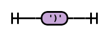

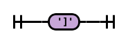
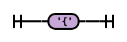
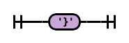
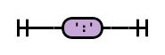
.. |image72| image:: lexar-output/image73.png
   :width: 7.26492in
   :height: 2.43479in
.. |image73| image:: lexar-output/image74.png
   :width: 7.26492in
   :height: 2.43479in
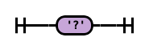
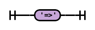
.. |image76| image:: lexar-output/image77.png
   :width: 7.25762in
   :height: 2.33146in
.. |image77| image:: lexar-output/image78.png
   :width: 7.26492in
   :height: 2.43479in
.. |image78| image:: lexar-output/image79.png
   :width: 7.25762in
   :height: 2.33146in
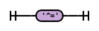

.. |image81| image:: lexar-output/image82.png
   :width: 7.26546in
   :height: 2.24104in
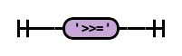
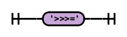
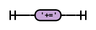
.. |image85| image:: lexar-output/image86.png
   :width: 7.25762in
   :height: 2.33146in
.. |image86| image:: lexar-output/image87.png
   :width: 7.25762in
   :height: 2.33146in
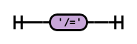
.. |image88| image:: lexar-output/image89.png
   :width: 7.25762in
   :height: 2.33146in
.. |image89| image:: lexar-output/image90.png
   :width: 7.26492in
   :height: 2.43479in
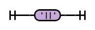
.. |image91| image:: lexar-output/image92.png
   :width: 7.25762in
   :height: 2.33146in
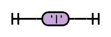
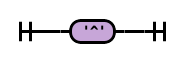
.. |image94| image:: lexar-output/image95.png
   :width: 7.26492in
   :height: 2.43479in

.. |image96| image:: lexar-output/image97.png
   :width: 7.25762in
   :height: 2.33146in
.. |image97| image:: lexar-output/image98.png
   :width: 7.26546in
   :height: 2.24104in
.. |image98| image:: lexar-output/image99.png
   :width: 7.26492in
   :height: 2.43479in
.. |image99| image:: lexar-output/image100.png
   :width: 7.26492in
   :height: 2.43479in

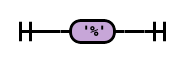
.. |image103| image:: lexar-output/image104.png
   :width: 7.25762in
   :height: 2.33146in
.. |image104| image:: lexar-output/image105.png
   :width: 7.25762in
   :height: 2.33146in
.. |image105| image:: lexar-output/image106.png
   :width: 7.25762in
   :height: 2.33146in
.. |image106| image:: lexar-output/image107.png
   :width: 7.26492in
   :height: 2.43479in
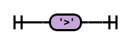

.. |image109| image:: lexar-output/image110.png
   :width: 7.25762in
   :height: 2.33146in
.. |image110| image:: lexar-output/image111.png
   :width: 7.26492in
   :height: 2.43479in
.. |image111| image:: lexar-output/image112.png
   :width: 7.26492in
   :height: 2.43479in
.. |image112| image:: lexar-output/image113.png
   :width: 7.25762in
   :height: 2.33146in
.. |image113| image:: lexar-output/image114.png
   :width: 7.21003in
   :height: 1.71979in
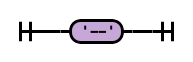
.. |image115| image:: lexar-output/image116.png
   :width: 7.2735in
   :height: 1.52396in
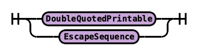
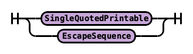
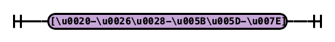
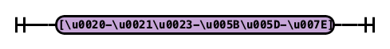

.. |image121| image:: lexar-output/image122.png
   :width: 7.25406in
   :height: 1.43542in

.. |image124| image:: lexar-output/image125.png
   :width: 7.28165in
   :height: 1.42333in
.. |image125| image:: lexar-output/image126.png
   :width: 7.25782in
   :height: 1.24646in
.. |image126| image:: lexar-output/image127.png
   :width: 7.27292in
   :height: 1.14698in
.. |image127| image:: lexar-output/image128.png
   :width: 7.25158in
   :height: 0.77729in
.. |image128| image:: lexar-output/image129.png
   :width: 7.26277in
   :height: 1.80833in
.. |image129| image:: lexar-output/image130.png
   :width: 7.24707in
   :height: 0.92771in

.. |image131| image:: lexar-output/image132.png
   :width: 7.243in
   :height: 1.24031in

.. |image142| image:: lexar-output/image9.png
   :width: 7.25587in
   :height: 2.07312in

.. |image144| image:: lexar-output/image15.png
   :width: 7.25498in
   :height: 1.86646in
.. |image145| image:: lexar-output/image140.png
   :width: 7.25684in
   :height: 1.93104in
.. |image146| image:: lexar-output/image25.png
   :width: 7.25587in
   :height: 2.07312in

.. |image151| image:: lexar-output/image142.png
   :width: 7.26546in
   :height: 2.24104in

.. |image153| image:: lexar-output/image57.png
   :width: 7.27138in
   :height: 2.15708in

.. |image156| image:: lexar-output/image66.png
   :width: 7.24565in
   :height: 2.42833in
.. |image157| image:: lexar-output/image144.png
   :width: 1.3848in
   :height: 10.50333in

.. |image160| image:: lexar-output/image74.png
   :width: 7.26492in
   :height: 2.43479in
.. |image161| image:: lexar-output/image90.png
   :width: 7.26492in
   :height: 2.43479in
.. |image162| image:: lexar-output/image77.png
   :width: 7.25762in
   :height: 2.33146in
.. |image163| image:: lexar-output/image146.png
   :width: 7.27238in
   :height: 1.13062in

.. |image165| image:: lexar-output/image147.png
   :width: 7.23729in
   :height: 1.29427in

.. |image167| image:: lexar-output/image148.png
   :width: 7.25768in
   :height: 2.23156in
.. |image168| image:: lexar-output/image114.png
   :width: 7.2668in
   :height: 1.73333in

.. |image172| image:: lexar-output/image149.png
   :width: 7.27374in
   :height: 1.87115in
.. |image173| image:: lexar-output/image73.png
   :width: 7.26492in
   :height: 2.43479in

.. |image175| image:: lexar-output/image150.jpeg

