|image0|\ sourceUnit :

pragmaDirective :

|image1|

|image2|\ pragmaName :

pragmaValue :

|image3|

|image4|\ version :

|image5|\ versionOperator :

versionConstraint : importDeclaration :

|image6|

|image7|

importDirective :

|image8|

|image9|\ NatSpecSingleLine :

NatSpecMultiLine :

|image10|

|image11|\ natSpec :

contractDefinition : inheritanceSpecifier :

|image12|

|image13|

contractPart :

|image14|

|image15|\ stateVariableDeclaration :

usingForDeclaration : structDefinition :

|image16|

|image17|

|image18|\ constructorDefinition :

modifierDefinition :

|image19|

|image20|\ modifierInvocation :

functionDefinition :

|image21|

|image22|\ returnParameters :

modifierList : eventDefinition :

|image23|

enumValue :

|image24|

|image25|

enumDefinition :

|image26|

|image27|\ parameterList :

parameter :

|image28|

eventParameterList : eventParameter :

|image29|

|image30|

functionTypeParameterList :

|image31|

|image32|\ functionTypeParameter :

variableDeclaration :

|image33|

|image34|\ typeName :

userDefinedTypeName : mapping :

|image35|

|image36|

functionTypeName :

|image37|

|image38|\ storageLocation :

stateMutability : block :

|image39|

statement :

|image40|

|image41|\ expressionStatement :

ifStatement :

|image42|

|image43|\ whileStatement :

simpleStatement :

|image44|

forStatement :

|image45|

|image46|

inlineAssemblyStatement :

|image47|

|image48|\ doWhileStatement :

continueStatement :

|image49|

|image50|\ breakStatement :

returnStatement :

|image51|

|image52|\ throwStatement :

emitStatement :

|image53|

variableDeclarationStatement : variableDeclarationList :

|image54|

|image55|

identifierList :

|image56|

elementaryTypeName : Int :

|image57|

|image58|

Uint : Byte :

|image59|

|image60|

|image61|\ Fixed :

Ufixed :

|image62|

|image63|\ expression : primaryExpression :

expressionList :

|image64|

nameValueList :

|image65|

|image66|

|image67|\ nameValue :

functionCallArguments :

|image68|

|image69|\ functionCall :

assemblyBlock :

|image70|

|image71|\ assemblyItem : assemblyExpression :

|image72|

|image73|\ assemblyCall :

assemblyLocalDefinition :

|image74|

|image75|\ assemblyAssignment :

assemblyIdentifierOrList :

|image76|

|image77|\ assemblyIdentifierList :

assemblyStackAssignment :

|image78|

|image79|\ labelDefinition :

|image80|\ assemblySwitch :

assemblyCase :

|image81|

|image82|\ assemblyFunctionDefinition :

assemblyFunctionReturns :

|image83|

|image84|\ assemblyFor :

assemblyIf :

|image85|

|image86|\ assemblyLiteral : subAssembly :

tupleExpression :

|image87|

|image88|

typeNameExpression :

|image89|

|image90|\ numberLiteral :

|image91|\ identifier :

VersionLiteral :

|image92|

|image93|\ BooleanLiteral :

DecimalNumber :

|image94|

DecimalDigits : HexNumber :

|image95|

|image96|

HexDigits :

|image97|

|image98|\ NumberUnit : HexLiteral :

HexPair :

|image99|

|image100|\ HexCharacter :

|image101|

|image102|\ ReservedKeyword : AnonymousKeyword :

BreakKeyword :

|image103|

|image104|\ ConstantKeyword :

ContinueKeyword :

|image105|

ExternalKeyword :

|image106|

|image107|

|image108|\ IndexedKeyword :

InternalKeyword :

|image109|

|image110|\ PayableKeyword :

PrivateKeyword : PublicKeyword :

|image111|

|image112|

PureKeyword :

|image113|

|image114|\ TypeKeyword :

ViewKeyword : Identifier :

|image115|

|image116|

IdentifierStart :

|image117|

|image118|\ IdentifierPart :

StringLiteral :

|image119|

DoubleQuotedStringCharacter : SingleQuotedStringCharacter :

|image120|

|image121|

WS :

|image122|

|image123|\ COMMENT :

LINE_COMMENT :

|image124|

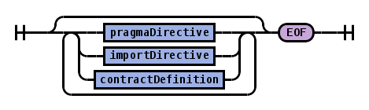
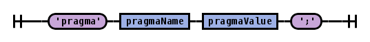
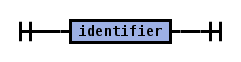
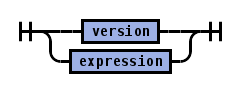
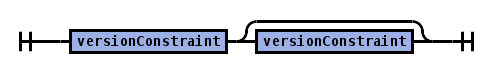
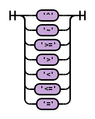
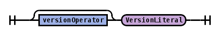
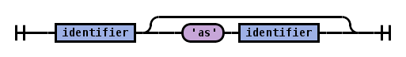
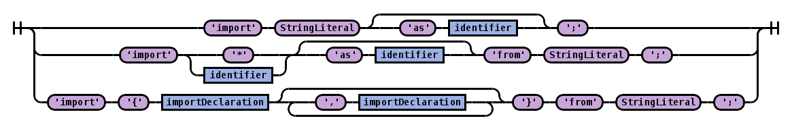
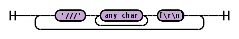
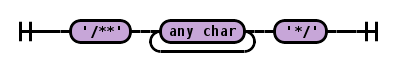
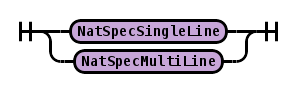
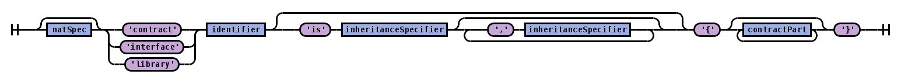
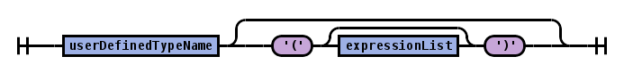
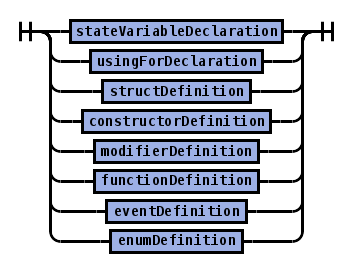
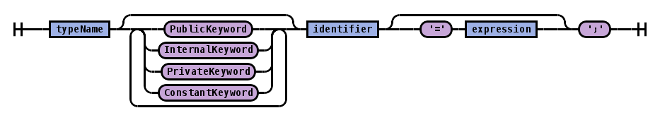
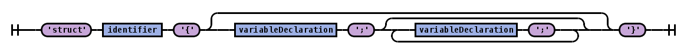
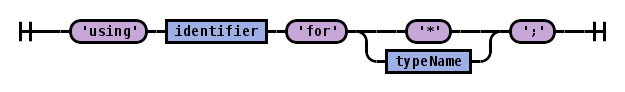
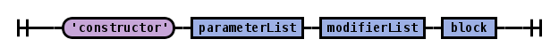
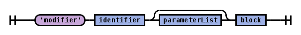
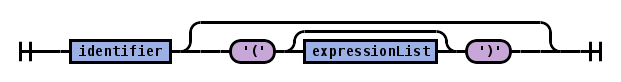
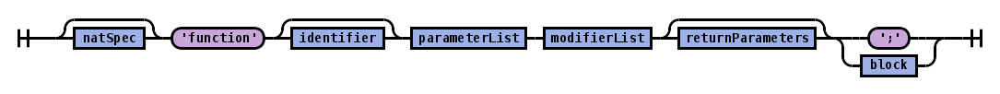
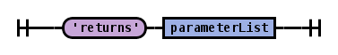
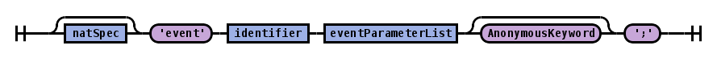
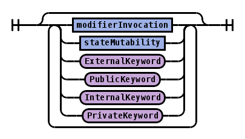

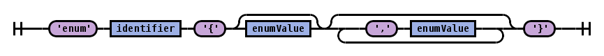
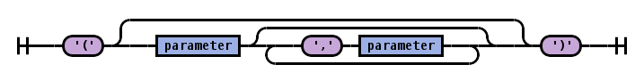
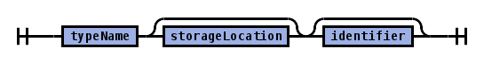
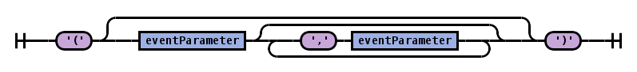
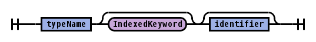
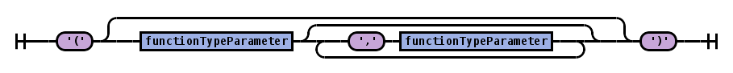
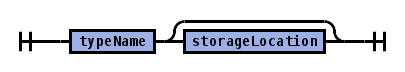
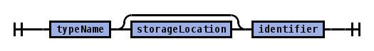
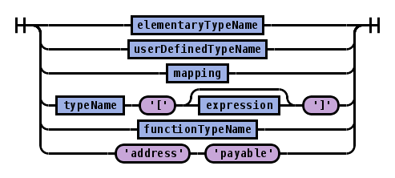
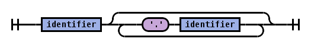
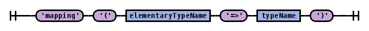
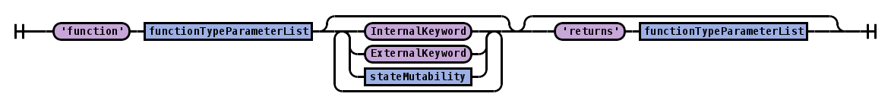
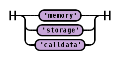
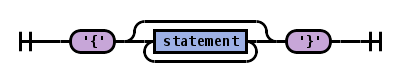
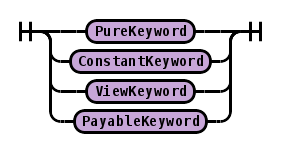
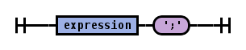
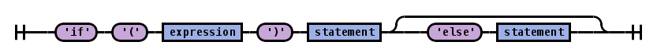
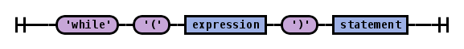
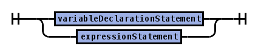
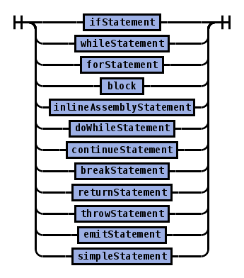
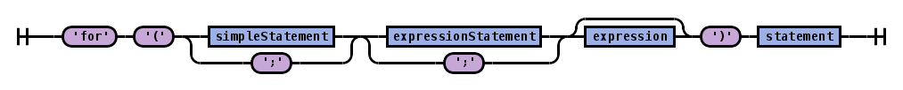
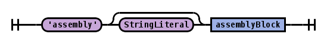
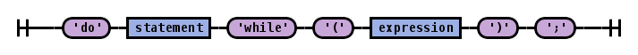
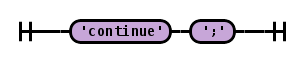
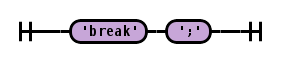

